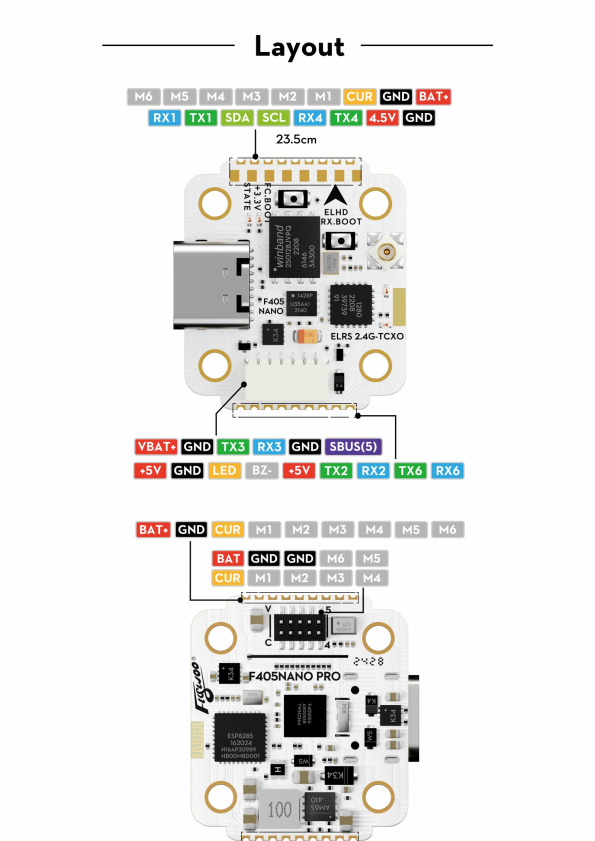
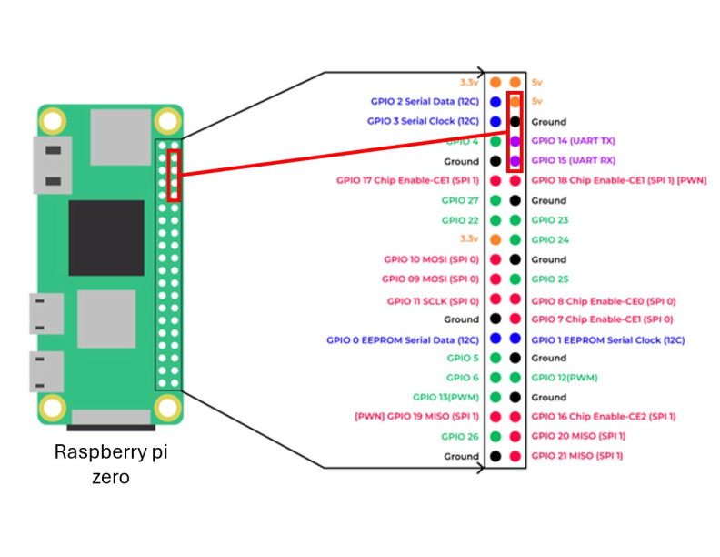
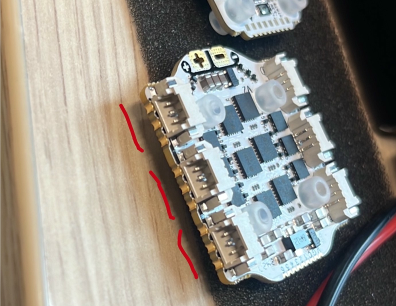

# Step 02 - Electronics and Soldering

This step covers the soldering and initial electrical validation of the wiring, power connection, and the Raspberry Pi. The propellers must remain removed throughout this stage. (Open image to zoom):

Wiring diagram for the quadcopter can be found at: [Quad Wiring Diagram](../hardware/images/Quad_Wiring_Diagram.svg)

## 1. Practice before using the final hardware

If you have limited soldering experience, practice first using spare flight controllers/ESCs, wires, or unused electronic components. This reduces the risk of damaging the flight controller, ESC, motors, or Raspberry Pi.

In this project, spare hardware was also used to become familiar with flight-controller firmware flashing and configurator software before working with the final components.

## 2. Review the wiring diagram

Before soldering, identify the following connections:

- six motors to the six ESC outputs;
- XT30 battery connector to the positive and negative ESC power pads;
- capacitor to the ESC power pads;
- flight controller to the ESC;
- Raspberry Pi UART wires:
  - 5 V;
  - ground;
  - flight-controller TX2 <-> Raspberry Pi UART RX;
  - flight-controller RX2 <-> Raspberry Pi UART TX

Check the labels printed on the boards and compare them with the wiring diagram before applying heat. Do not rely only on wire colour.

> **Important:** TX and RX must be crossed between devices. The flight-controller TX wire connects to Raspberry Pi RX, and flight-controller RX connects to Raspberry Pi TX. Both devices must share a common ground.

## 3. Prepare a safe soldering workspace

Soldering was performed in a well-ventilated area. The following equipment was used:

- soldering iron;
- suitable solder;
- desoldering pump;
- flux;
- wire cutters and strippers;
- tweezers or helping hands;
- heat-resistant work surface;
- multimeter;
- protective eyewear;
- fume extractor if available.

Avoid breathing solder fumes and wait 5-10 seconds before touching recently soldered pads or components.

## 4. Solder the motors to the ESC

Each brushless motor has three phase wires. The three wires of each motor were soldered to one of the six ESC motor outputs.

At this stage, the order of the three phase wires is not critical as long as the middle wire is soldered to the middle pad. This is because swapping any outer phase wire reverses the motor direction. Motor direction can also be corrected later through ESC configuration through BetaFlight/IndiFlight.

**The Motor pads are on the sides of the ESC:**
 

After soldering:

- Inspect each joint for incomplete wetting;
- Check that neighbouring pads are not bridged. You can use the assistance of the multimeter for checking this;
- Gently pull each wire to confirm that it is mechanically secure;
- Keep the wires long enough to reach the motors after final frame assembly.

## 5. Solder the battery connector and capacitor

The XT30 battery connector was soldered to the positive and negative power-input pads of the ESC. The polarity (+/-) must match the 4S battery connector.

The capacitor was connected across the same power input:

- capacitor positive (longer leg) to ESC positive;
- capacitor negative (shorter leg) to ESC negative.

Electrolytic capacitors are polarised. Reversing the capacitor may damage it or cause it to fail.

Before connecting a battery, use a multimeter to verify:

- correct battery-connector polarity;
- continuity whe re expected;
- no short circuit between the positive and negative power pads.

## 6. Prepare the Raspberry Pi connection

Four wires were soldered to the selected flight-controller UART and power pads:

- 5 V;
- GND;
- RX2;
- TX2.

The opposite ends were soldered to female header connectors so that the Raspberry Pi could later be connected and removed when needed.

Male header pins were soldered to the Raspberry Pi Zero 2 W. Right-angled header pins are preferable when vertical clearance is limited because they reduce cable strain and simplify mounting. Straight headers were used in this project because suitable right-angled headers were unavailable.

The Raspberry Pi should not yet be connected unless its operating system has already been installed on the SD Card.

## 7. Assemble the flight-controller stack and frame

### 7.0 Screw sizes
  - Short screw: M2 ?mm
  - Medium screw: M2 ?mm
  - Long screw: M2 ?mm
  - Extra long screw: M2 ?mm

### 7.1 Connect the flight controller and ESC
The flight controller was connected directly to the ESC using the FC–ESC stack connector.

 During assembly, the ESC may pull on the soldered motor wires. Check that none of the solder joints are placed under too much tension.

### 7.2 Mount the FC–ESC stack on the central plate

Place the connected FC–ESC stack on top of the central plate and insert the extra-long mounting screws through the stack and the core plate. 

Take care while positioning the stack, making sure the flight controller stays leveled to prevent the FC-ESC stack connector pins to bend. Do not screw in the screws too tightly as it might cause a short circuit if the screws touch either one of the boards.

From underneath the central plate, screw 15 mm or 25 mm standoffs onto the same mounting screws. The required standoff length depends on the frame design and the amount of clearance required beneath the central plate.

Lastly, secure the landing legs on the standoffs the long screws. 

### 7.3 Attach the arms

Position the six arms around the central plate and secure them using extra-long screws.

Arm placement is important. Before tightening the screws, confirm that:

- the arms are arranged symmetrically;
- opposite arms are aligned with one another;
- neighbouring arms do not overlap;
- sufficient space remains for the XT30 battery connector and capacitor;
- the motor wires can reach the ESC without excessive tension;
- the intended propeller discs will not overlap.

Do not secure the arms with screws before checking the placement of the remaining arms. It is easier to adjust the complete arrangement while all arms remain unscrewed.

### 7.4 Attach the motors to the intermediary motor mounts

Each motor was first attached to its intermediary motor-mount part before the mount was installed on the arm.

Insert the short screw on the side of the intermediary part facing the centre of the drone. This screw should be installed first because the motor wires may block access after the motor has been mounted.

Secure the motor to the intermediary part using the medium-length motor screws.

> **Important:** Do not overtighten the motor screws. A screw that extends too far into the motor may block motor rotation. After mounting, rotate the motor bell by hand and confirm that it moves freely without scraping or resistance.

### 7.5 Attach the motor mounts to the arms

Place each motor-and-mount assembly onto the end of its corresponding arm. Insert the long mounting screws through the intermediary part and arm, and secure them using washers and nuts.

Tighten the nuts securely to reduce the risk of the loosening of the screws due to vibration during motor operation.

### 7.6 Route and secure the motor wires

Route the motor wires from each arm towards the ESC. Secure them using zip ties or another (non-conductive) fastening method.

The wires should:

- remain clear of the propeller area;
- not be stretched too tightly;
- not place tension on the ESC solder joints.

## 8. Perform the first electrical sanity check

The first power-up must be performed without propellers.

Before connecting the battery:

- Inspect all solder joints;
- Ensure that loose wires cannot contact one another;
- The motors are secured well.

Connect the XT30 connector briefly to a compatible 4S battery. Observe the ESC and flight-controller LEDs to confirm that the electronic stack starts normally.

Disconnect the battery immediately if:

- a component becomes unusually hot or starts glowing;
- smoke and/or an unusual smell is detected;
- the boards do not start normally;
- the battery connector sparks excessively.

Many FLYWOO flight controllers are supplied with Betaflight firmware already installed. If the flight controller is not recognised while the ESC does operate, continue with the firmware-verification procedure described in [Step 3: Firmware Setup](Step_03_Firmware_Setup.md).

## Expected output

At the end of this step, you should have:

- six motors soldered to the ESC;
- the XT30 connector and capacitor installed;
- Raspberry Pi power and UART wires prepared;
- the flight controller connected to the ESC;
- the FC–ESC stack mounted on the central plate;
- six arms attached in the intended arrangement;
- six motors mounted securely on the arms;
- a successful initial power-up using a compatible 4S battery.

Example of how your drone can look like (without the landing legs):

The assembled platform is now ready for firmware installation, motor-output verification, and control-allocation configuration.