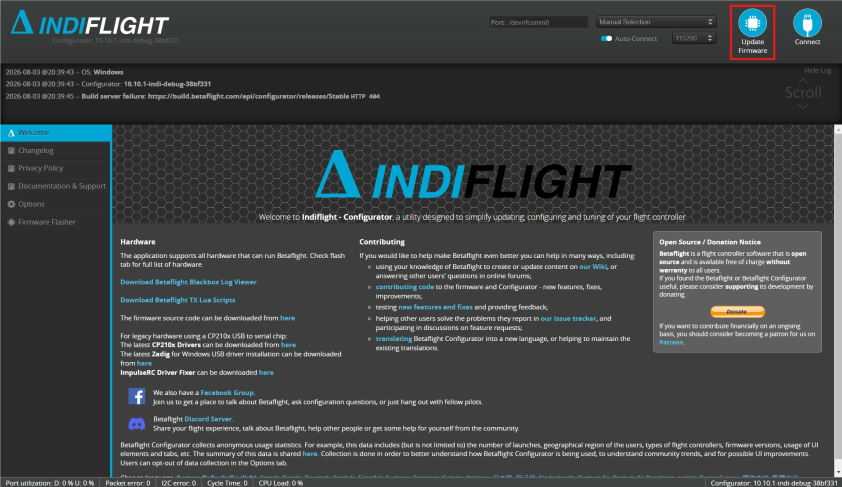
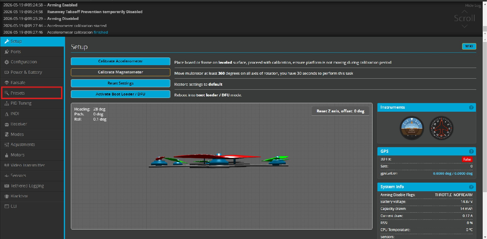

# Step 03 - IndiFlight Firmware and Motor Allocation

This step covers installing IndiFlight, loading the board-specific preset, calculating morphology-specific actuator parameters, and verifying the order and direction of all motors.

> **Important:** Remove all propellers before connecting the battery or testing any motor. Use an USB C to USB A/C cable that can transfer data.

## 1. Install the IndiFlight Configurator

Download and install the required version of the IndiFlight Configurator:
- [Windows](https://drive.google.com/file/d/1BCz5W1CJ8OM-d3ddKI6Ye7_psWJEMYHs/view?usp=sharing): Extract the zip folder and run `indiflight-configurator.exe`.
- [Linux](https://drive.google.com/file/d/1hG0SwiQj1v-RlrC4UwjHnRno__QZiaeP/view?usp=sharing):  Right-click the package, Select "Open with Another application" and
select "Software Install".
- MacOS: *Not available at the moment.*

(**Disclaimer:** These are temporary, unofficial archives hosted on Google Drive because this configurator build is no longer available from the official IndiFlight GitHub repository.)

After starting the application, connect the flight controller to the computer using USB. The flight controller may need to be placed in Device Firmware Upgrade (DFU) mode before the firmware can be flashed.

## 2. Place the flight controller in DFU mode

To enter DFU mode:

1. Disconnect the USB cable.
2. Press and hold the boot button on the flight controller.
3. Reconnect the USB cable while continuing to hold the button.
4. Release the button after the board has only a red LED turned on.

Open **Firmware Flasher** in the IndiFlight Configurator:



## 3. Flash the IndiFlight firmware

In the firmware flasher:

1. Select **Enable Expert Mode**.
2. Enable **Full Chip Erase**
3. Select **Load Firmware [Local]**.
4. Select the provided [.hex file](../indiflight/firmwares/indiflight_5.0.0_STM32F405.hex). **Disclaimer:** This firmware does **not** include the Neural Network Controller, which is considered a dangerous mode. If you would like include the NN Controller, build a new .hex file on the [IndiFlight repo](https://github.com/tudelft/indiflight) 
5. Select **Flash Firmware** and you will be prompted for selecting a device. Select the flight controller or something like **STM32 bootloader**.
7. Wait until the flashing procedure finishes before unplugging the board.

After flashing, reconnect the flight controller normally and confirm that the IndiFlight Configurator recognises it.

### [FIX] Windows driver troubleshooting

If the flight controller is not recognised when connected to a Windows computer (in DFU mode or not), a USB driver may need to be installed using [Zadig](https://zadig.akeo.ie/).

1. Open Zadig
2. Select Options -> List all devices
3. Select the flight-controller or STM32 bootloader device. 
4. Install the appropriate USB driver. 

Be careful to select the correct device, as replacing the driver of an unrelated USB device may cause it to stop functioning correctly. After installing the driver, restart the IndiFlight Configurator and reconnect the flight controller.

## 4. Adapt the default preset to the drone morphology

The repository contains a default IndiFlight configuration for the FLYWOOF405NANO flight controller:

[`DEFAULT_BTFL_cli_20260518_145507_FLYWOOF405NANO.txt`](../indiflight/presets/DEFAULT_BTFL_cli_20260518_145507_FLYWOOF405NANO.txt)

This preset contains the board-specific configuration required to operate the flight controller, including:

- flight-controller resource mappings;
- six motor outputs;
- the `HEX6X` mixer;
- sensor configuration;
- UART assignments;
- ExpressLRS settings;
- Blackbox logging settings;
- actuator and control-effectiveness parameters.

The default file should be copied before modification so that the original configuration remains available as a reference. For example:

```text
MODIFIED_BTFL_cli_20260518_145507_FLYWOOF405NANO.txt
- or
HEX_BASELINE_BTFL_cli.txt
```

> **Important:** This preset is specific to the FLYWOOF405NANO flight controller. Do not load it onto another flight-controller model without first adapting its resource mappings, sensors, UARTs, and motor outputs.

The board-specific parts of the preset can normally remain unchanged when using the same flight controller. However, the actuator configuration inside the `indiprofile 0` section must be updated according to the physical morphology of the drone.

The morphology-specific values are calculated using:

[`genGMC_hex.py`](../indiflight/presets/genGMC_hex.py)

The script calculates the (G_1) and (G_2) control-effectiveness terms used by IndiFlight:

* **(G_1)** describes the steady-state forces and moments produced by each motor.
* **(G_2)** describes rotational effects associated with changes in rotor speed and rotor inertia.

These values depend on the vehicle geometry, motor order, motor directions, mass, inertia, propellers, and actuator properties. Incorrect measurements, units, or motor ordering can therefore produce an incorrect control allocation.

### 4.1 Install the Python requirements

Create a virtual environment and then install the requirements: 
```bash
python3 -m pip install -r requirements.txt
```

### 4.2 Update the vehicle properties

Before running the script, update the morphology and actuator properties inside genGMC_hex.py.

The example values included in the script are specific to the tested platform. Do not assume that they are valid for another drone, especially when its frame geometry, motors, propellers, battery, or mass distribution differ.

#### Vehicle dimensions and mass


- `width` and `length` are expressed in metres.
- `m` is the complete flight mass in kilograms.
```python
width = 0.220 
length = 0.220
m = 0.295
```
The mass should include the frame, electronics, motors, propellers, Raspberry Pi, battery, wiring, and any other components carried during flight.

For unconventional morphologies, width and length alone do not fully describe the motor geometry. The individual motor positions in the X matrix must also be updated.

#### Vehicle inertia

The rotational inertia can be entered directly:

```python
Ixx = 1.07e-3
Iyy = 1.11e-3
Izz = 1.49e-3
```

Alternatively, it can be estimated from pendulum measurements using `Px`, `Py`, and `Pz`.

The inertia values must be expressed in `kg m^2`. Values from another drone may be used as an initial approximation only when the geometry, total mass, and mass distribution are sufficiently similar.

#### Propeller and motor properties

* `mp` is the mass of one propeller in kilograms.
* `Dpinch` is the propeller diameter in inches.
* `motorNumber` describes the motor dimensions used to estimate motor-bell inertia. You can find it printed on the motor or in its product specification.

```python
mp = 1.64e-3
Dpinch = 3.0
motorNumber = 1404
```

The exact propeller model should be used because two propellers with the same diameter may have different masses and inertial properties.

The script also contains:

- `tau` is the assumed motor and propeller response time. It can be estimated from a motor step-response test or obtained from previously validated data for the same motor, ESC, and propeller combination.
- `Tmax` is the maximum thrust produced by one motor. You might find it the motor's product specifications.
```python
tau = 0.025
Tmax = 0.355 * GRAVITY
```

If measured values are unavailable, the supplied defaults may be retained as initial estimates when using similar hardware.

#### Motor rotation directions

```python
direc = [1, 1, -1, -1, -1, 1]
```

Each entry represents the rotation direction of one motor. The order used by the supplied script is:

1. rear right (`RR`);
2. front right (`FR`);
3. rear left (`RL`);
4. front left (`FL`);
5. middle right (`MR`);
6. middle left (`ML`).

#### Motor positions

The `X` matrix defines the position of each motor relative to the centre of mass.

- `arm` is the distance from the centre of mass to the motor axis in metres.
- `delta` adjusts the angular position of the diagonal arms.

```python
arm = 0.110
delta = np.deg2rad(7.5)
```

For an evolved or irregular morphology, update the complete `X` matrix so that every column represents the measured position of the corresponding motor.

```python
X = np.array([
    [x1, x2, x3, x4, x5, x6],
    [y1, y2, y3, y4, y5, y6],
    [z1, z2, z3, z4, z5, z6],
])
```

#### Motor thrust axes

The `axes` matrix defines the thrust direction of every motor:

```python
axes = np.array([
    [0.0, 0.0, -1.0],
    [0.0, 0.0, -1.0],
    [0.0, 0.0, -1.0],
    [0.0, 0.0, -1.0],
    [0.0, 0.0, -1.0],
    [0.0, 0.0, -1.0],
]).T
```

For a conventional hexacopter, all motors may use the same vertical thrust axis. For tilted or unconventional motors, replace each vector with the thrust direction of the corresponding motor.

**Finally**, run the script:

```bash
python genGMC_hex.py
```

### 4.3 Update the preset with the calculated values

Running the script prints the following values:

```text
g1_fx
g1_fy
g1_fz
g1_roll
g1_pitch
g1_yaw
g2_roll
g2_pitch
g2_yaw
```

Open the copied preset and locate the `indiprofile 0` section. Replace the corresponding actuator lines with the values printed by the script:

```text
set indi_act_g1_fx = ...
set indi_act_g1_fy = ...
set indi_act_g1_fz = ...
set indi_act_g1_roll = ...
set indi_act_g1_pitch = ...
set indi_act_g1_yaw = ...

set indi_act_g2_roll = ...
set indi_act_g2_pitch = ...
set indi_act_g2_yaw = ...
```

For a six-motor platform, also verify:

```text
set indi_act_num = 6
```

Save the modified file under a new name. This modified preset will be loaded into the IndiFlight Configurator after the firmware has been flashed.

## 5. Load the IndiFlight preset

Make sure the flight controller is plugged and connected to the IndiFlight configurator. Open the **Presets** tab.




Select "Load backup" and upload the preset. When loaded, select "Save anyway" to save the configuration when prompted.

After loading the preset, open the CLI and run:

```bash
dump all
```

For the baseline hexacopter, verify the following motor resources:

```text
MOTOR 1 B00
MOTOR 2 B01
MOTOR 3 A03
MOTOR 4 A02
MOTOR 5 B05
MOTOR 6 C09
```

Also verify:

```text
mixer HEX6X
```

## 6. Verify the motor direction

Connect the battery while keeping the propellers removed. Place the frame on a stable surface and keep wires and hands clear of the motors.

Open the **Motors** tab:


Select **Motor direction** and then select the option to set the motor directions **individually**.

Compare the physical direction with the direction shown in the configurator diagram. Reverse individual motors where required until all six motors match the intended rotation pattern. Confirm that every motor rotates smoothly. If a motor produces scraping, resistance, or irregular movement, slightly loosen the motor-mounting screws on the intermediary part and test it again.

## Expected output

At the end of this part of Step 03, you should have:

- IndiFlight firmware installed;
- the flight controller recognised by the IndiFlight Configurator;
- morphology-specific (G_1) and (G_2) values updated on the preset;
- the modified preset loaded on the board;
- all motor rotation directions verified with the right directions.
