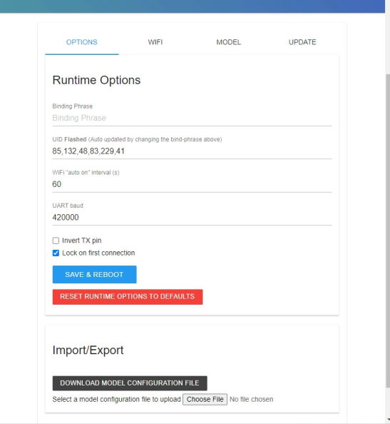
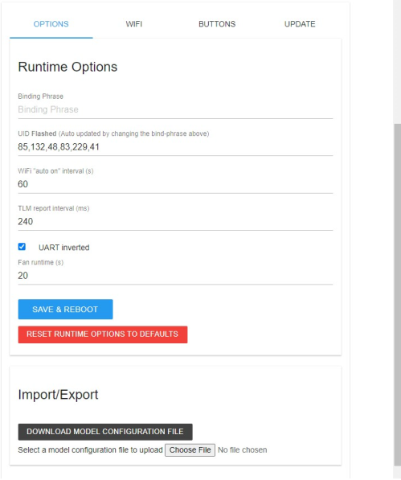
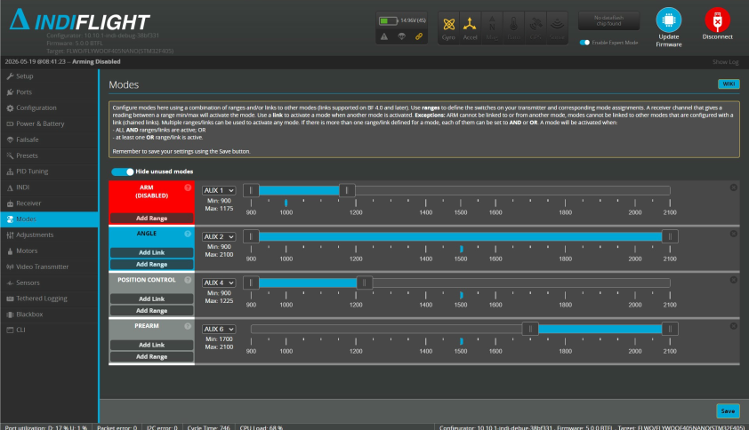
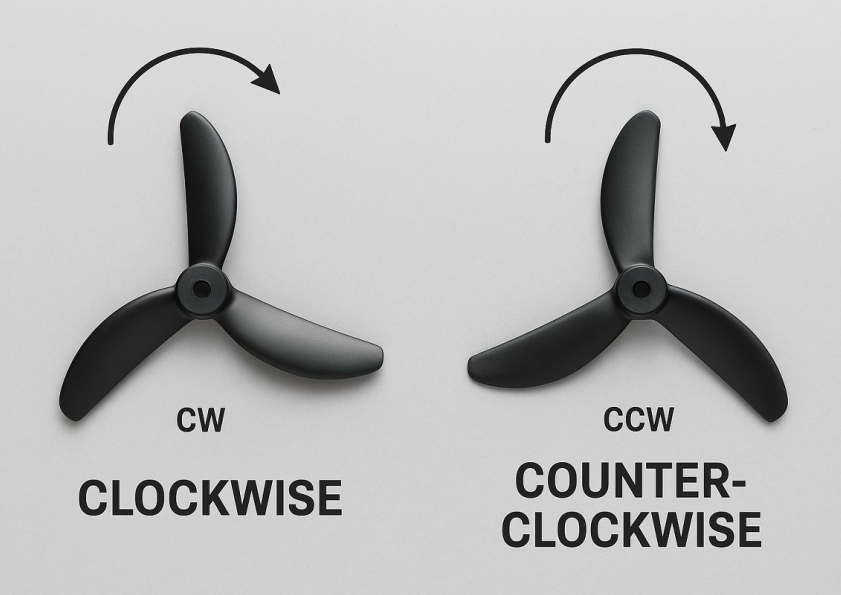

# Step 04 - Transmitter Connection and Liftoff

This step covers configuring the transmitter, establishing the ExpressLRS radio connection, verifying the receiver inputs, and preparing the drone for its first manual liftoff.

The drone uses **ExpressLRS (ELRS)** as the radio-control link. ExpressLRS provides the wireless connection between the transmitter and the ExpressLRS receiver on the drone. The receiver then communicates with the flight controller using the **CRSF protocol**.

Some transmitters are available with ExpressLRS hardware built in, including several RadioMaster transmitters. In this project, a **FrSky Taranis Q X7** was used. Since this transmitter does not contain an internal ExpressLRS transmitter, an **external ExpressLRS module** was installed in the module bay on the back of the transmitter.

The following instructions therefore focus specifically on configuring the Taranis Q X7 with an external ExpressLRS module.

## 1. Power the transmitter

Before configuring the transmitter, make sure that a suitable battery is available.

Several battery options can be used with the Taranis Q X7:

- **NiMH battery pack:** A suitable 7.2 V NiMH battery pack can be installed in the transmitter battery compartment.
- **2S-3S LiPo battery:** A 2S-3S LiPo battery with a voltage between 6V and 15V and if it also has a compatible connector.
- **AA batteries:** A compatible battery tray can be used with six AA batteries.

In this project, a **2S LiPo battery** was used.

Also verify that the selected battery voltage is supported by the external ExpressLRS module. The external module bay is powered from the transmitter battery, so changing the transmitter battery voltage also changes the voltage supplied to the external module.

## 2. Install the external ExpressLRS module

The ExpressLRS transmitter module is installed in the external module bay on the back of the Taranis Q X7.

Insert the module into the bay and make sure that it is fully seated.

Attach the antenna supplied with the ExpressLRS module before powering the transmitter.

> **Important:** Do not operate the ExpressLRS transmitter module without an antenna attached. Transmitting without an antenna may damage the module's radio-frequency (RF) hardware.

At this stage, the transmitter should contain:

- a compatible battery;
- the external ExpressLRS module;
- the ExpressLRS antenna.

## 3. Update the OpenTX firmware

Before configuring ExpressLRS, check that the transmitter is running an appropriate version of **OpenTX**. You can do it by holding the menu button and pressing on page until you open the **VERSION** menu. Then compare the firmware version with the latest version available at [OpenTX Downloads](https://www.open-tx.org/downloads). If the firmware matches with the latest version, you can skip this step.

Easiest way to update the firmware is to use the firmware updating software **OpenTX Companion** and a Micro-USB cable. The software can be also installed at OpenTX Downloads. Alternatively, the firmware can be updated by copying the `.bin` file to the **FIRMWARE** folder on the SD card, if an Micro-USB cable is not available. In that case, complete step 4 first.

Before updating the transmitter, it is recommended to back up the existing radio configuration and models using OpenTX Companion.

The general update procedure is:

1. Install and open OpenTX Companion.
2. Enter bootloader mode by pressing and holding both horizontal digital trims inward. While holding them, press the power button.
2. Connect the transmitter to the computer using a Micro-USB cable.
3. Select "Read Models and Settings from Radio."
4. Select "Downloads" and then download the appropriate OpenTX firmware.
5. Flash the firmware to the transmitter. This can be done either via a Micro-USB cable or directly from the transmitter if the firmware file is stored on the SD card.
6. Restart the transmitter and verify the version.

The following video demonstrates the firmware-update procedure:

[OpenTX Firmware Update Tutorial](https://www.youtube.com/watch?v=dJ4dSKjrLxk)

> **Note:** The video demonstrates an older OpenTX version, but the general firmware-update procedure is similar.

## 4. Prepare the OpenTX SD card

An SD card is required to store the OpenTX files and the ExpressLRS Lua script.

Use a microSD card that is compatible with the transmitter.

If your SD card does not have the offical OpenTX SD card contents already, the SD card contents for the Taranis Q X7 can be downloaded from:

[OpenTX Q X7 SD Card Contents](https://downloads.open-tx.org/2.3/release/sdcard/opentx-x7/)

Download the SD card package corresponding to the OpenTX version installed on the transmitter and copy them to the empty/formatted SD card

The SD card should finally contain directories such as:

```text
SCRIPTS/
SOUNDS/
LOGS/
MODELS/
...
```

## 5. Install the ExpressLRS Lua script

The ExpressLRS Lua script provides a menu on the transmitter for configuring and interacting with the external ExpressLRS module.

The current Lua script and installation instructions can be found in the official ExpressLRS documentation:

[ExpressLRS Lua Script](https://www.expresslrs.org/quick-start/transmitters/lua-howto/)

Place the ExpressLRS `.lua` file inside:

```text
SCRIPTS/TOOLS/
```

There are two ways to copy the file.

### Option 1 - Copy directly to the SD card

Insert the SD card into the computer.

Copy the ExpressLRS Lua script to:

```text
SCRIPTS/TOOLS/
```

Then safely eject the SD card and insert it into the transmitter.

### Option 2 - Access the SD card through the transmitter

Leave the microSD card inside the transmitter and connect the transmitter to the computer using a Micro-USB cable.

When the SD card becomes available on the computer, copy the ExpressLRS Lua script to:

```text
SCRIPTS/TOOLS/
```

Disconnect the transmitter safely after the transfer has completed.

## 6. Verify the ExpressLRS Lua script

After installing the script, verify that OpenTX can find it.

On the Taranis Q X7:

1. Turn on the transmitter.
2. Hold the **MENU** button to open the system menu. You will find the tools menu there.
3. Scroll through the available tools.
4. Locate the **ExpressLRS** Lua script.
5. Select the script to check that it can be opened.

If the ExpressLRS menu appears, the Lua script has been installed correctly.

If it does not, you might wanna lower the baudrate. On our Transmitter, we had to lower the standard Baudrate of 400k to 115k (ill explain this later)

At this stage, the ExpressLRS module does not yet need to be bound to the drone. The next step is to create and configure the transmitter model before establishing the connection with the receiver.

## 6. Create and configure a transmitter model

The Taranis Q X7 uses separate models to store transmitter configurations. Create a new model specifically for the drone.

From the main transmitter screen:

1. Short-press **MENU** to open the Model Selection menu.
2. Highlight an empty model slot.
3. Hold the **ENT** button and select **Create Model**.
4. Select **Multi** when asked for the model type.
5. After the model is created, press **EXIT** to leave the setup wizard.

> **Note:** The **ENT** button on the Taranis Q X7 is located in the centre of the rotary dial on the right side of the transmitter.

### 6.1 Configure the RF settings

Highlight the newly created model and press **PAGE** to open the **Model Setup** page.

A descriptive model name can be entered here to make the configuration easier to recognise later.

Scroll down to **Internal RF**:

1. Highlight the current mode.
2. Press **ENT**.
3. Rotate the dial until **OFF** is selected.
4. Press **ENT** again to confirm.

The internal RF module is not used because the radio link is provided by the external ExpressLRS module.

Next, scroll to **External RF** and configure it using the same procedure.

Set:

```text
External RF -> CRSF
```

CRSF is used for communication between OpenTX and the external ExpressLRS transmitter module.

## 7. Configure the transmitter mixer

Before configuring the receiver inside IndiFlight, configure the channel assignments on the Taranis Q X7.

Open the model mixer:

```text
MENU -> Select Model -> PAGE -> MIXER
```

Configure the channels as follows:

```text
CH1  Ail  Weight 100
CH2  Ele  Weight 100
CH3  Thr  Weight 100
CH4  Rud  Weight 100
CH5  SF   Weight 100
CH6  SB   Weight 100
CH10 SH   Weight 100
```

These channels are used as:

| Channel | Input | Purpose |
|---|---|---|
| CH1 | Ail | Roll |
| CH2 | Ele | Pitch |
| CH3 | Thr | Throttle |
| CH4 | Rud | Yaw |
| CH5 | SF | ARM / AUX1 |
| CH6 | SB | Flight mode / AUX2 |
| CH10 | SH | PREARM / AUX6 |

The channel names can also be changed to descriptive names such as `ARM`, `MODE`, and `PREARM` for easier identification later.

For each mixer entry, make sure that:

```text
Weight = 100
Multiplex = Replace
```

The switch channels can otherwise remain at their default values.

## 8. Bind the ExpressLRS receiver and transmitter

Before establishing the radio connection, attach the ExpressLRS receiver antenna to the flight controller.

Make sure that the antenna is installed correctly and positioned away from the propellers and other moving parts.

Turn on the Taranis Q X7 and open the ExpressLRS Lua script installed earlier.

Scroll down to:

```text
WiFi Connectivity
```

Do not enable the transmitter Wi-Fi yet. The receiver should be configured first.

### 8.1 Put the ExpressLRS receiver into Wi-Fi mode

Power the flight controller either by:

- connecting the battery; or
- connecting the flight controller through USB.

The receiver can be placed into Wi-Fi mode in two ways.

#### Option 1 - Wait for automatic Wi-Fi mode

Leave the receiver powered without an active ExpressLRS connection.

In the configuration used in this project, the receiver enters Wi-Fi mode after approximately 60 seconds.

#### Option 2 - Use the receiver boot button

Press and hold the receiver's boot button for approximately **5 seconds**.

When Wi-Fi mode is active, the receiver's green LED should begin blinking rapidly.

### 8.2 Connect to the receiver Web UI

On the computer, open the Wi-Fi settings and connect to:

```text
ExpressLRS RX
```

Use the password:

```text
expresslrs
```

After connecting, the ExpressLRS Web UI may open automatically. If it does not, open a browser and navigate to:

```text
http://10.0.0.1/
```

### Receiver Web UI:



Open the section containing the **Binding Phrase** option.

Enter a unique and memorable binding phrase.

For example:

```text
potato
```

The exact phrase is not important, but **the same phrase must later be entered into the transmitter module**.

> **Important:** Record the binding phrase before continuing. ExpressLRS uses the phrase to generate the identifier used to associate the receiver with the transmitter module.

Select **Save and Reboot**.

Wait until the Web UI confirms that the settings were successfully saved.

After rebooting, the receiver LED may return to a slower blinking state while it waits for a compatible ExpressLRS transmitter.

### 8.3 Configure the transmitter binding phrase

Return to the Taranis Q X7 and open the ExpressLRS Lua script again.

Navigate to:

```text
WiFi Connectivity -> Enable WiFi
```

The external ExpressLRS transmitter module will now create its own Wi-Fi network.

On the computer, connect to:

```text
ExpressLRS TX
```

using the password:

```text
expresslrs
```

Again, navigate to:

```text
http://10.0.0.1/
```
### Transmitter Web UI:


Enter **exactly the same binding phrase** that was entered on the receiver.

Select **Save and Reboot** and wait for confirmation that the settings were successfully saved.

After both devices reboot, the transmitter and receiver should automatically establish a connection.

A successful connection is normally indicated by the receiver LED remaining **solid instead of blinking**.

If the receiver continues blinking, verify that:

- the binding phrase is identical on both devices;
- the transmitter module is configured using CRSF;
- the external RF module is enabled;
- the ExpressLRS transmitter and receiver firmware versions are compatible;
- if the LED begins blinking rapidly, the receiver did not bind to the transmitter in time; reconnect to the **ExpressLRS RX** Wi-Fi network and repeat the binding process.

## 9. Verify the receiver channels in IndiFlight

Connect the flight controller to the computer using USB and open the **IndiFlight Configurator**.

Open the **Receiver** tab.

Set the channel map to:

```text
AETR1234
```

Then press **Save**.

This channel order corresponds to:

```text
A = Aileron / Roll
E = Elevator / Pitch
T = Throttle
R = Rudder / Yaw
```

With the throttle stick completely down and the remaining sticks centred, the receiver values should be approximately:

```text
Roll      = 1500
Pitch     = 1500
Yaw       = 1500
Throttle  = 1000

AUX1 / SF = 1000 or 2000
AUX2 / SB = 1000, 1500, or 2000
AUX6 / SH = 1000 or 2000
```

Move each transmitter stick individually and verify that the corresponding channel moves in the IndiFlight Configurator.

For the transmitter configuration used in this project:

- the **left stick vertical axis** controls throttle;
- the **left stick horizontal axis** controls yaw;
- the **right stick vertical axis** controls pitch;
- the **right stick horizontal axis** controls roll.

Also operate the `SF`, `SB`, and `SH` switches and verify that their corresponding AUX channels change.

Do not continue until the stick and switch inputs behave as expected.

## 10. Configure the flight modes

Open the **Modes** tab in the IndiFlight Configurator.



The following mode assignments were used in this project:

```text
ARM              AUX1   [900-1100]
ANGLE            AUX2   [900-2100]
POSITION CONTROL AUX4   [900-1100]
PREARM           AUX6   [1700-2100]
```

After configuring the ranges, press **Save**.

Operate each transmitter switch while viewing the Modes tab and verify that the corresponding mode becomes active only in the intended switch position.

> **Important:** Verify the ARM and PREARM ranges particularly carefully before installing the propellers. The drone must not arm when the switches are in their normal safe positions.

The transmitter and ExpressLRS connection are now configured.

## 11. Install the propellers

Only install the propellers after the following have already been verified:

- correct motor allocation;
- correct motor rotation direction;
- working transmitter connection;
- correct stick inputs;
- working ARM and PREARM switches.

Refer to the motor-direction diagram from the previous step:


Each propeller must match the rotation direction of the motor on which it is installed.

Clockwise and counter-clockwise propellers have different blade orientations. Check the shape of the leading edge of the blade before installing each propeller.



After installing the propellers, manually rotate each one and check that:

- the propeller turns smoothly, if not, loosen the motor screws; 
- it does not contact another propeller;
- it does not contact the frame;
- no cable enters the propeller path;
- the propeller is securely attached;
- its direction matches the motor-direction configuration.

## 12. Prepare for the first manual liftoff

Before attempting the first liftoff, perform a complete mechanical inspection.

Make sure that all cables are secured using zip ties and that:

- no cable is dangling from the frame;
- no cable can enter a propeller path;
- no wire is under excessive tension;

The battery must be fully charged and also be secured firmly to the frame.

Use a sufficiently tight battery strap so that the battery cannot slide or fall out during sudden movement. Additional high-friction material may be placed between the battery and frame to reduce movement.

Possible materials include:

- rubber or elastic material;
- electrical tape;
- non-slip battery pads;
- grip or sandpaper-style tape.

Sandpaper-style grip tape was used successfully in this project.

For the tested platform, mounting the battery underneath the central plate also lowered the vehicle's centre of mass and provided a mechanically convenient mounting position.

After securing the battery, lift and gently move the drone by hand to confirm that the battery cannot slide out of position.

## 13. Practise manual control before flying

Before flying the physical drone, it is strongly recommended to practise **line-of-sight multicopter control in a flight simulator**.

The Taranis Q X7 can be connected to a computer through USB and used as a controller in compatible simulators.

Practise at least:

- gradual takeoff;
- maintaining approximately constant altitude;
- roll and pitch corrections;
- yaw control;
- controlled landing;
- immediate disarming.

The objective is to become familiar with the transmitter stick response before operating the physical vehicle.

## 14. Perform the first manual liftoff

The first flight should be a short manual liftoff intended only to confirm that the assembled platform can leave the ground and respond correctly to transmitter commands.

Do not test position control or autonomous flight during this initial test.

### 14.1 Prepare the flight area

Place the drone in a dedicated flight area with sufficient free space.

A protected or netted flight arena is strongly recommended.

During operation:

- keep all the flight area clear from people;
- remain behind the safety net or barrier;
- keep the transmitter in your hands while the drone is armed.

Perform one final check that all propellers, motor mounts, arms, battery straps, and cables are secure.

### 14.2 Arm the drone

Place the drone on a level surface.

Keep the throttle completely down.

For the transmitter configuration used in this project:

1. Activate the **PREARM** switch using `SH`, located on the lower-right side of the transmitter.
2. Activate the **ARM** switch using `SF`, located on the lower-left side of the transmitter.

After arming, the motors should begin spinning at idle speed.

If the motors do not behave as expected, disarm the drone and investigate the problem before continuing.

> **Warning:** Once the drone is armed, treat the propellers as dangerous. Do not approach or touch the drone while it is armed.

### 14.3 Perform the liftoff

Slowly increase the throttle.

Do not immediately apply a large throttle input. Increase it gradually until the drone becomes light on its landing gear and begins to lift from the ground.

Observe whether the drone:

- rises approximately vertically;
- remains controllable;
- responds correctly to roll and pitch inputs;
- does not strongly rotate around the yaw axis;
- does not produce excessive vibration;
- does not immediately tip towards one motor.

For the first test, only lift the drone a small distance from the ground.

Keep a finger ready on the **ARM/DISARM switch at all times**.

If the drone tilts unexpectedly, oscillates strongly, rotates uncontrollably, or moves in an unexpected direction, immediately lower the throttle and disarm.

[Table for common problems]

After confirming that the vehicle can successfully lift off and respond to manual commands, land the drone gradually and disarm it before approaching.

## Expected output

At the end of this step, you should have:

- a configured Taranis Q X7 model;
- transmitter mixer channels configured;
- binded the ExpressLRS transmitter and receiver;
- ARM, PREARM, and flight-mode switches configured;
- propellers installed in the correct directions;
- the battery and wiring securely mounted;
- a successful short manual liftoff.

The platform is now ready for integration with the Raspberry Pi and external motion-capture system.